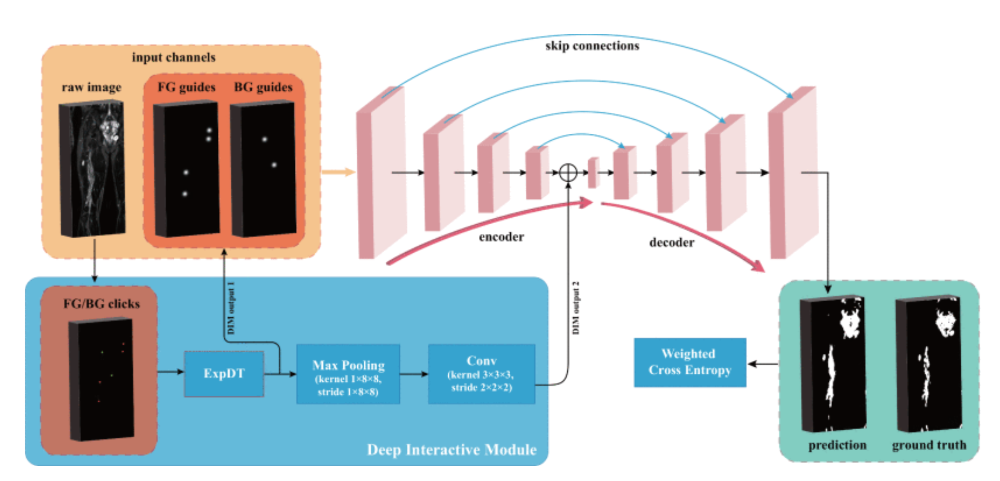

# DINs
This is the official implementation of the paper [DINs: Deep Interactive Networks for Neurofibroma Segmentation in Neurofibromatosis
Type 1 on Whole-Body MRI](https://ieeexplore.ieee.org/abstract/document/9449950/). ([arXiv](https://arxiv.org/pdf/2106.03388.pdf))

Authors: Jian-Wei Zhang; Wei Chen; K. Ina Ly; Xubin Zhang; Fan Yan; Justin Jordan; Gordon Harris; Scott Plotkin; Pengyi Hao; Wenli Cai

## 0. Introduction

Neurofibromatosis type 1 (NF1) is an autosomal dominant tumor predisposition syndrome that involves the central and peripheral nervous systems. Accurate detection and segmentation of neurofibromas are essential for assessing tumor burden and longitudinal tumor size changes. Automatic convolutional neural networks (CNNs) are sensitive and vulnerable as tumors’ variable anatomical location and heterogeneous appearance on MRI. In this study, wepropose deep interactive networks (DINs) to address the above limitations. User interactions guide the model to recognize complicated tumors and quickly adapt to heterogeneous tumors. We introduce a simple but effective Exponential Distance Transform (ExpDT) that converts user interactions into guide maps regarded as the spatial and appearance prior. Comparing with popular Euclidean and geodesic distances, ExpDT is more robust to various image sizes, which reserves the distribution of interactive inputs. Furthermore, to enhance the tumor-related features, we design a deep interactive module to propagate the guides into deeper layers. We train and evaluate DINs on three MRI data sets from NF1 patients. The experiment results yield significant improvements of 44% and 14% in DSC comparing with automated and other interactive methods, respectively. We also experimentally demonstrate the efficiency of DINs in reducing user burden when comparing with conventional interactive methods.



## 1. Requirements

```bash
# We have test the code with tensorflow-gpu==2.8
conda create -n dins -c conda-forge python=3.8 tensorflow-gpu=2.8 cudatoolkit cudnn
conda activate dins
pip install medpy nibabel tensorflow-addons==0.18.0
# Install Sacred==0.8.3 from source
pip install git+https://github.com/IDSIA/sacred.git@0.8.3
conda install -c conda-forge pandas scipy scikit-image opencv tqdm
```

## 2. Prepare datasets

* Neurofibroma (Whole-Body MRI, 3D nii format) data directory

  ```text
  ./data/NF/
    nii_NF/
      - volume-008.nii.gz
      - volume-009.nii.gz
      - volume-010.nii.gz
      - ...
      - segmentation-008.nii.gz
      - segmentation-009.nii.gz
      - segmentation-010.nii.gz
      - ...
    test_NF/
      - 000000-img.nii.gz
      - 000000-mask.nii.gz
      - 000001-img.nii.gz
      - 000001-mask.nii.gz
      - 000002-img.nii.gz
      - 000002-mask.nii.gz
      - ...
  ```

  We use `./data/NF/nii_NF` for training/evaluation in cross-validation, and `./data/NF/test_NF` for only testing.

  Segmentation file should only contain {0, 1} where 0 for background and 1 for tumors. 

* Create your data list, as that in 
  * `./data/NF/split.csv` for 'nii_NF'
  * `./data/NF/split_test.csv` for 'test_NF' 
  * `./data/NF/nf_box.csv` for 'test_NF' with bounding boxes, where 
    * `split`: in [0, 1, 2, 3, 4] for 5-fold cross-validation 
    * `pid`: the number in `volume-010.nii.gz`
    * `remove`: if set to 1, then the case will be ignored in training/testing

## 3. Usage

Add a helper function `cuda` to your default bashrc `~/.bashrc`, which simplifies the environment variables. 

* `TF_CPP_MIN_LOG_LEVEL=3`: Disable TensorFlow debugging outputs
* `CUDA_VISIBLE_DEVICES=0`: Set GPU ID to used in current experiment, only single GPU card is supported.

```bash
function cuda()
{
    if [ "$#" -eq 0 ]; then
        return
    fi
    GPU_ID=$1
    shift 1
    TF_CPP_MIN_LOG_LEVEL=3 CUDA_VISIBLE_DEVICES="$GPU_ID" $@
}
```

Remember to re-login or execute `source ~/.bashrc` to activate the help function.

### 3.1 Training

```bash
# Training with default settings
cuda 0 python entry3d.py train
# Training with custom parameters
cuda 0 python entry3d.py train with fold=1 bs=2 guide=euc
```

### 3.2 Testing

We provide a pretrained model trained on 100 Whole-Body NF MRIs.
* [Google Drive](https://drive.google.com/file/d/1Zi9rdnYqH1n8GiPWOiLbTp6x_bpaCqfD/view?usp=sharing)
* [Baidu Drive](https://pan.baidu.com/s/1TiscGpqqPr_yi-HpL776jg). Code: `mmjp`

```bash
# Test the whole volumes of val set 
cuda 0 python entry3d.py test with fold=0 resume_dir=logs/1/bestckpt -u
# Test the whole volumes of test set 
cuda 0 python entry3d.py test with fold=0 resume_dir=logs/1/bestckpt test_set=test -u
# Test only within boundbox areas
cuda 0 python entry3d.py test with fold=0 resume_dir=logs/1/bestckpt test_set=test use_box=True -u
```

### 3.3 Note

* 24GB GPU memory is recommended.
* The default config `depth`, `height`, `width`, `test_height`, and `test_width` (see `./config.py`) are for 
Whole-Body MRI, which has a shape of about [20, 1024, 320]. If your data has a significant different size, please set 
these configs during training and testing.
* Custom experiment ID with extra arguments `-i 1234`. 
* Disable experiment ID with `-u`, and the default log directory will be `./logs/None`.
* This project is built with a scaffold [Sacred](https://github.com/IDSIA/sacred). See the 
  [doc](https://sacred.readthedocs.io/en/stable/) for better playing with Sacred.
* If you want to try the geodesic distance guide, install the GeodisTK from `./third_party/GeodisTK`:

  ```bash
  cd ./third_party/GeodisTK
  python setup.py install
  ```
    
## 4. Bibtex

If you find our work helpful for your research, please consider citing the following BibTeX entry.

```bibtex
@ARTICLE{zhang2022dins,
  author={Zhang, Jian-Wei and Chen, Wei and Ly, K. Ina and Zhang, Xubin and Yan, Fan and Jordan, Justin and Harris, Gordon and Plotkin, Scott and Hao, Pengyi and Cai, Wenli},
  journal={IEEE Journal of Biomedical and Health Informatics}, 
  title={DINs: Deep Interactive Networks for Neurofibroma Segmentation in Neurofibromatosis Type 1 on Whole-Body MRI}, 
  year={2022},
  volume={26},
  number={2},
  pages={786-797},
  doi={10.1109/JBHI.2021.3087735}}
```
